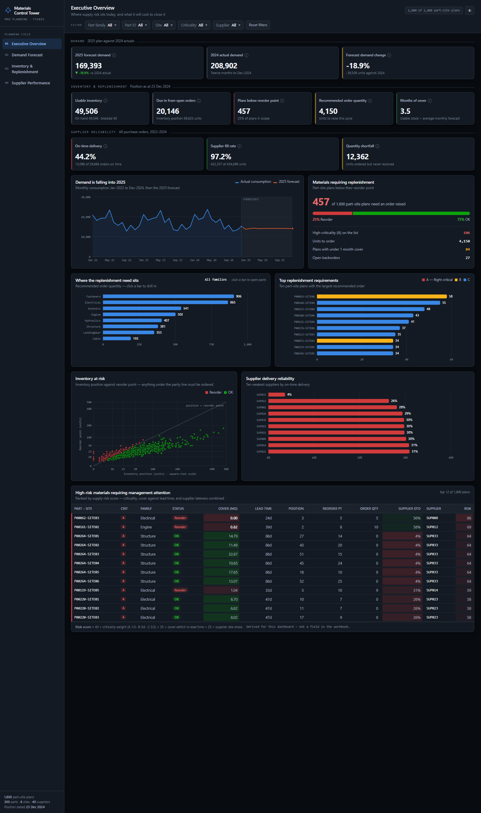
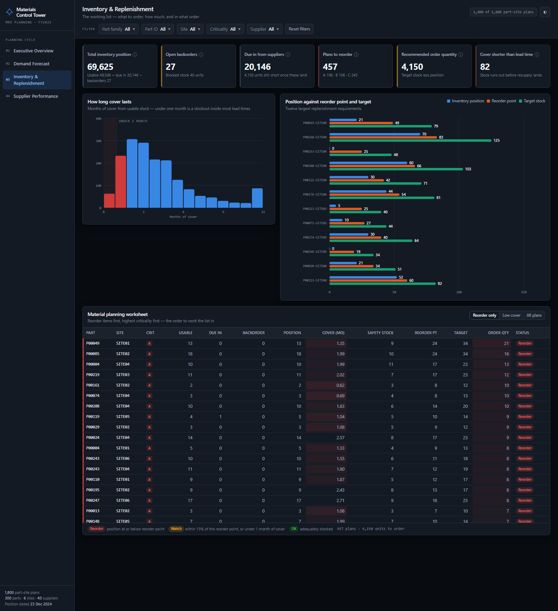

# Aerospace Materials Planning & Supply Chain Analytics

An interactive materials planning decision-support dashboard for a commercial aerospace MRO operation — built for a Materials / Supply Chain Manager to work from, not just to look at.

**▶ Live dashboard: https://sujataprabhakar.github.io/Aerospace-Materials-Planning-and-Supply-Chain-Analytics/**

The dashboard tells one connected story across four pages:

> **Forecast demand → assess inventory availability → identify replenishment requirements → evaluate supplier reliability.**

---

## Scope of the data

| | |
|---|---|
| Part–site plans | 1,800 |
| Parts | 300 across 8 part families |
| Sites | 6 |
| Suppliers | 40 |
| Purchase orders | 29,666 (2022–2024) |
| Demand history | 36 months, Jan-2022 → Dec-2024 |
| Forecast horizon | 12 months, calendar 2025 |
| Inventory position dated | 23 December 2024 |

## The four pages

**01 · Executive Overview** — eleven headline KPIs grouped into demand, inventory and supplier bands; the demand trend and 2025 forecast; the reorder split; where the replenishment need sits (drill-down); inventory position against reorder point; the weakest suppliers; and a ranked table of high-risk materials.

**02 · Demand Forecast** — three years of actual consumption against the 2025 plan, with actuals and forecast clearly separated; rising and falling demand movers; demand by part family and by site; and an inspector to pull up the 36-month history and 12-month forecast for any single part–site combination.

**03 · Inventory & Replenishment** — the operational page. Months-of-cover distribution, inventory position against reorder point and target stock, and a sortable material planning worksheet ordered the way the list should actually be worked: reorder items first, highest criticality first.

**04 · Supplier Performance** — delivery reliability and quantity fulfilment. On-time delivery, fill rate, average late days, planned against actual lead time, lead-time variance, quantity shortfall, and a full supplier scorecard with conditional formatting.

## Questions it answers

- Which parts need to be reordered now, and how much should we order?
- Which high-criticality parts have insufficient inventory?
- Which sites carry the highest replenishment requirement?
- Which items have less cover than their supplier's lead time — i.e. will stock out even if we order today?
- Are incoming purchase orders enough to prevent shortages?
- Which parts have rising forecast demand?
- Which suppliers deliver late, and how late when they do?
- Which suppliers under-ship?
- Are actual supplier lead times materially different from the planned figures?

## Features

- **Five cross-filtering slicers** — part family, part ID, site, criticality, supplier. Every KPI, chart and table on every page recomputes against the same selection.
- **Drill-down** — Part Family → Part → Site, with breadcrumb navigation.
- **Conditional formatting** — red for items requiring immediate reorder, amber for items near the reorder point or under a month of cover, green for adequately stocked; criticality severity rails on every table row.
- **Tooltips on every mark and KPI**, giving the definition and the source column so nothing needs explaining out loud.
- **Sortable decision tables** and deep-linkable pages.
- **Light and dark themes**, both designed rather than inverted.
- **Fully self-contained** — one HTML file, no build step, no external requests, no CDN. Works offline by double-clicking `index.html`.

## Three findings worth discussing

**1 · The 2025 forecast is 18.9% below 2024, and that is a method artefact.** Demand fell steadily through 2024 (21,254 units in January to 15,068 in December). The three-month moving average anchors on Q4-2024 and carries that low point forward flat at roughly 14,100 units a month. A moving average cannot project a trend or a season. If the 2024 decline was a genuine fleet effect the plan is sound; if it was a one-off, the plan systematically under-buys. The dashboard states this on the forecast page rather than hiding it.

**2 · Lateness is the system-wide supplier problem, not shortfall.** Only 44.2% of purchase orders arrive by the promised date, and actual lead times run 1.2 days over the planning figure of 41.8 days on average — so safety stock built on planned lead times is systematically short. Quantity fulfilment is sound by contrast at 97.2%. The action is to re-baseline planning lead times against actuals, supplier by supplier, before adding stock.

**3 · Incoming orders do not close the gap.** 20,146 units are due in on open purchase orders, but due-ins are already counted inside inventory position — so the 4,150-unit recommended order quantity is what remains short *after* every open order lands.

## Data integrity

Every measure on the dashboard is either a column of the source workbook or an aggregation of one.

The supplier metrics are recomputed client-side so they respond to the slicers. Their definitions were validated against the workbook's own grand totals to six decimal places:

| Measure | Dashboard | Workbook |
|---|---|---|
| On-time delivery | 0.44151554 | 0.44151554 |
| Fill rate | 0.97156193 | 0.97156193 |
| Average late days (late orders only) | 3.32924915 | 3.32924915 |
| Average actual lead time | 42.97151621 | 42.97151621 |
| Quantity ordered / received | 434,699 / 422,337 | 434,699 / 422,337 |
| Quantity shortfall | 12,362 | 12,362 |

Three measures are **derived** rather than taken from the workbook, and each is labelled as derived in the interface:

- **Supply-risk score** — a composite of criticality weight, cover deficit against lead time, and supplier late share. The formula is printed in the table footer.
- **Backtest MAE** — the workbook computes a three-month moving-average MAE for one plan only (`P00001-SITE01`, MAE 1.85). The same method is applied here to all 1,800 plans; the reproduction of that plan returns 1.85 exactly.
- **"Cover shorter than lead time"** — months of cover compared against lead time expressed in months.

One quirk of the source worth knowing: `Usable Inventory` subtracts blocked stock only, while `Inventory Position` also nets off backorders. That is why total position (69,625) sits 27 units below usable plus due-in — 27 being the exact backorder total.

## Design notes

The colour palette was validated programmatically rather than by eye: the categorical series pass lightness-band, chroma-floor, colour-vision-deficiency separation and contrast checks against both the light and dark chart surfaces. Status colours (good / warning / critical) are reserved and never reused as series colours.

Two charts depart from the obvious choice for honesty reasons. The inventory scatter uses a **square-root scale** — the median position is 22 units against a maximum of 480, so a linear axis buries the crowd at the origin. Supplier fill rate is a **dot plot on a 93% baseline** rather than a bar chart, because every supplier sits between 94% and 97% and zero-baseline bars all looked identical.

## Repository contents

| File | Purpose |
|---|---|
| `index.html` | The dashboard. Self-contained; open it directly or view the live link above. |
| `docs/` | Page screenshots. |

## Tech

Vanilla JavaScript and hand-built inline SVG — no charting library, no framework, no dependencies at runtime. Hosted on GitHub Pages.

The data was prepared in Python (pandas, openpyxl): a build step reads the source workbook, reconciles the supplier metrics against the workbook's own grand totals, and writes a compact model of all 1,800 part–site plans — 36 months of history and 12 of forecast each. That model is inlined into `index.html` rather than fetched, which is what makes the page work offline and with no network requests at all.
